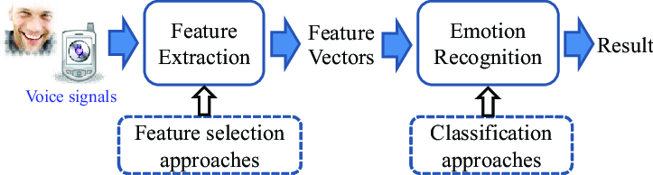

# Speech Emotion Recognition
## data preparation:

<p align="center"></p>


__Abstract__: Identifying emotion from speech is a non-trivial task pertaining to the ambiguous definition of emotion itself. In this work, we build light weight multimodal machine learning models and compare it against the heavier and less interpretable deep learning counterparts. For both types of models, we use hand-crafted features from a given audio signal. In this repo we are using TensorFlow to implement a CNN model and a ResNet model.

## Quick Links

- [Setup](#setup)
- [Training](#training)
- [Inference](#inference)


## Setup

### Software
Requirements:
* Python >= 3.6
* TensorFlow >= 2.4.1
* Install dependencies
    ```
    bash
    pip install -r requirements.txt
    
    ```
    
### Data

1. Download IEMOCAP dataset from [here](https://sail.usc.edu/iemocap/) into ```data/``` folder.
2. Download Ravdess dataset from [here](https://smartlaboratory.org/ravdess/) into ```data/``` folder.
3. Download Cremad dataset from [here](https://www.ncbi.nlm.nih.gov/pmc/articles/PMC4313618/) into ```data/``` folder.
4. Download Toronto emotional speech set (TESS) dataset from [here](https://tspace.library.utoronto.ca/handle/1807/24487) into ```data/``` folder.
5. Download IEMOCAP dataset from [here](http://kahlan.eps.surrey.ac.uk/savee/) into ```data/``` folder.

   ```
   bash
   python ./data_preparation.py \
   --output_data_directory\
   --augment_data \
   --data_extraction_type \
   ```
   
## Training The CNN mmodel


To train the CNN model, use the following command:
   ```
   bash
   python train.py
   ```

## Testing the model 

To test the CNN model and check the confusion matrix :

```
   bash
   python train.py
```

## To run the ResNet model

To run the ResNet model go to the folder: ``` Resnet/ ```
